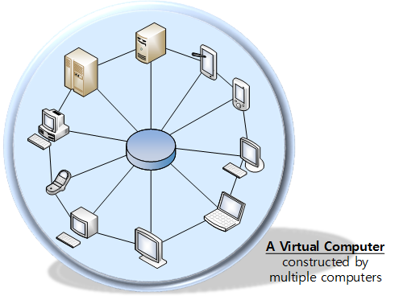
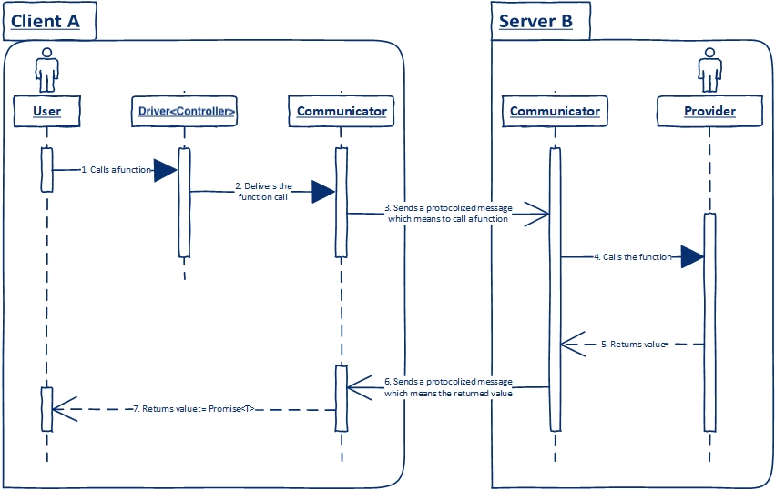
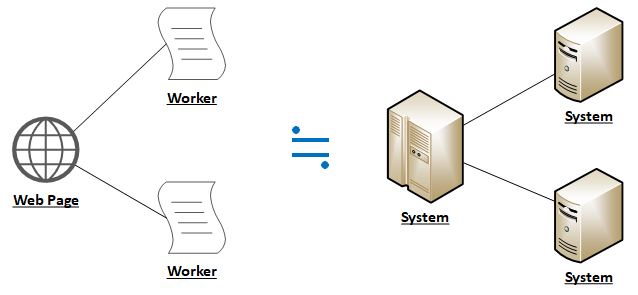

# Basic Concepts
In this lesson, we learn about the <u>Basic Concepts</u> of the **TGrid**.

The [1st chapter](#1-theory) will handle about the basic theories, what the true Grid Computing being supported by **TGrid** and what the Remote Function Call are. In the [2nd chapter](#2-components), we will learn about the basic components. Finally, the [last chapter](#3-protocols) discusses two protocols supported by **TGrid**: Web *Socket* and *Workers*.

If you like practice rather than theory and prefer one code reading rather than hundreds description listenings, just skip this lesson. For those of you, I recommend you to read the next lesson, [Learn from Examples](examples.md), first.


## 1. Theory
### 1.1. Grid Computing
Wekipedia says *Grid Computing* is:



https://en.wikipedia.org/wiki/Grid_computing

Grid computing is the use of widely distributed computer resources to reach a common goal. A computing grid can be thought of as a distributed system with non-interactive workloads that involve many files. Grid computing is distinguished from conventional high-performance computing systems such as cluster computing in that grid computers have each node set to perform a different task/application. Grid computers also tend to be more heterogeneous and geographically dispersed (thus not physically coupled) than cluster computers. Although a single grid can be dedicated to a particular application, commonly a grid is used for a variety of purposes. Grids are often constructed with general-purpose grid middleware software libraries. Grid sizes can be quite large.

Grids are a form of distributed computing whereby a "super virtual computer" is composed of many networked loosely coupled computers acting together to perform large tasks. For certain applications, distributed or grid computing can be seen as a special type of parallel computing that relies on complete computers (with onboard CPUs, storage, power supplies, network interfaces, etc.) connected to a computer network (private or public) by a conventional network interface, such as Ethernet. This is in contrast to the traditional notion of a supercomputer, which has many processors connected by a local high-speed computer bus.



In the description of Wikipedia about *Grid Computing*, I want to emphasize the word, "one virtual computer". In my opinion, the true *Grid Computing* is not just binding multiple computers with network communication and performming common goal. I think that the true *Grid Computing* means makings computers to be a single virtual computer. A program running on a single computer and another program runninng on the Distributed Processing System with millions of computers, both of them must have <u>similar program code</u>. It's the true *Grid Computing*.

Do you agree with me?

### 1.2. Remote Function Call


I think the real [Grid Computing](#11-grid-computing) means turning multiple computers into a single virtual computer. Also, code of the program mounted on the virtual computer must be similar with the code running on a single physical computer.

**TGrid** realizes the true [Grid Computing](#11-grid-computing) through *Remote Function Call*. It literally calling remote system's functions are possible. With the *Remote Function Call*, you can access to objects of remote system as if they have been in my memory from the beginning.

With **TGrid** and *Remote Function Call*, it's possible to handle remote system's objects and functions as if they're mine from the beginning. Do you think what that sentence means? Right, being able to call objects and functions of the remote system, it means that current and remote system are integrated into a <u>single virtual computer</u>.

### 1.3. Demonstration
In the previous chapter, I mentioned that **TGrid** and [Remote Function Call](#12-remote-function-call) can turn multiple computers into a single virtual computer. Also, the program code of the virtual computer is similar with another program code running on a single physical computer.

Thus, in this section, I will show you some brief demonstration codes. The demonstrations will proof the [Remote Function Call](#12-remote-function-call) can make multiple computers to be a single virtual computer. Also, we need to take a look at how the code using the [Remote Function Call](#12-remote-function-call).

 |  | 
:-----------:|:---------:|:------:
Hierarchical | Composite | Single

Three demonstration codes are all come from the [2.2. Learn from Examples](examples.md) lesson. Read the lesson if you want to know more about those demonstration codes. At now, we'll only concentrate one thing. That is, <u>business code</u> of those demonstration codes <u>are all similar</u>.

Whether the program you want to create is built with Grid Computing or runs on a single computer, there is no change in the business logic code. Even if you have two or four computers that make up Grid Computing, there is still no change in your business logic code. Because they are all integrated into one (virtual) computer. How can you make different programs for the same purpose running on a single computer?

I'll conclude this chapter with these words, "This is **TGrid**. This is [Remote Function Call](#12-remote-function-call)".


```typescript::Hierarchical
<!-- @import("https://raw.githubusercontent.com/samchon/tgrid.examples/master/src/projects/hierarchical-calculator/index.ts") -->
```
```typescript::Composite
<!-- @import("https://raw.githubusercontent.com/samchon/tgrid.examples/master/src/projects/composite-calculator/client.ts") -->
```
```typescript::Single
<!-- @import("https://raw.githubusercontent.com/samchon/tgrid.examples/master/src/projects/composite-calculator/single.ts") -->
```


> ```python
> 1 + 6 = 7
> 7 * 2 = 14
> 3 ^ 4 = 81
> log (2, 32) = 5
> SQRT (-4) -> Error: Negative value on sqaure.
> Mean (1, 2, 3, 4) = 2.5
> Stdev. (1, 2, 3, 4) = 1.118033988749895
> ```


## 2. Components


> ```typescript
> // ACCESS FROM NAMESPACES
> import tgrid = require("tgrid");
> 
> let communicator: tgrid.components.Communicator;
> let driver: tgrid.components.Driver<Controller>;
> 
> // IMPORT FROM MODULE
> import { Communicator, Driver } from "tgrid/components";
> 
> // IMPORT FROM FILES
> import { Communicator } from "tgrid/components/Communicator";
> import { Driver } from "tgrid/components/Driver";
> ```

### 2.1. Communicator
Communicates with Remote System.

`Communicator` is a class taking full responsibility to network communication with remote system. You can register a [Provider](#22-provider), an object would be provided to remote system, thorugh this `Communicator`. Also, [Driver](#24-driver)<[Controller](#23-controller)>, who can use remote system's [Provider](#22-provider), is created by this `Communicator`.

> `Communicator.getDriver<Controller>`

In addition, `Communicator` is the top-level abstract class. All the classes responsible for network communication in **TGrid** inherit this `Communicator` class. If you want to know more, go to the [3. Protocols](#3-protocols) chapter.


```typescript::Server
<!-- @import("https://raw.githubusercontent.com/samchon/tgrid.examples/master/src/projects/composite-calculator/server.ts") -->
```
```typescript::Client
<!-- @import("https://raw.githubusercontent.com/samchon/tgrid.examples/master/src/projects/composite-calculator/client.ts") -->
```


### 2.2. Provider
Object being provided for Remote System

`Provide` is an object provided for the remote system. The other system can remotely call the `Provider`'s functions through [Driver](#24-driver)<[Controller](#23-controller)>.

```typescript
export class Calculator
{
    public plus(x: number, y: number): number;
    public minus(x: number, y: number): number;
    public multiplies(x: number, y: number): number;
    public divides(x: number, y: number): number;

    public scientific: Scientific;
    public statistics: Statistics;
}
```

### 2.3. Controller
Interface of [Provider](#22-provider)

`Controller` is an interface of [Provider](#22-provider), provided from the remote system.

```typescript
export interface ICalculator
{
    plus(x: number, y: number): number;
    minus(x: number, y: number): number;
    multiplies(x: number, y: number): number;
    divides(x: number, y: number): number;

    scientific: IScientific;
    statistics: IStatistics;
}
```

### 2.4. Driver
`Driver` of [Controller](#23-controller) for [Remote Function Call](#12-remote-function-call)

`Driver` is an object for calling functions of the remote system. It is designed to specify a generic parameter [Controller](#23-controller). Through the `Driver<Controller>`, you can call functions of the [Provider](#22-provider), provided from the remote system. In other words, [Remote Function Call](#12-remote-function-call) means to call functions of [Provider](#22-provider), provided from the remote system, through the `Driver<Controller>`.

Also, when you assign a [Controller](#23-controller) into the generic parameter of `Driver`, the return type of all functions defined in the [Controller](#23-controller) would be promisified. If an internal object exists in the target [Controller](#23-controller), the object type would be converted as `Driver<object>`. Since those conversions are recursviely repeated, all the functions defined in the [Controller](#23-controller) would be promisified, regardless of their hierarchy depth.

```typescript
type Driver<ICalculator> = 
{
    plus(x: number, y: number): Promise<number>;
    minus(x: number, y: number): Promise<number>;
    multiplies(x: number, y: number): Promise<number>;
    divides(x: number, y: number): Promise<number>;

    readonly scientific: Driver<IScientific>;
    readonly statistics: Driver<IStatistics>;
};
```



In `Driver<Controller>`, all of the atomic variables like number and string are being ignored.

As you can see from the below code, all of the atomic variables defined in the [Controller](#23-controller) are disappeared. Therefore, when designing a [Provider](#22-provider) and you want to provide atomic variables to the remote system, you should define a getter or setter method like below.

  - *Something.getValue()*
  - *Something.setValue()*

```typescript
interface ISomething
{
    getValue(): number;
    setValue(val: number): void;

    value: number;
}

type Driver<ISomething> = 
{
    getValue(): Promise<number>;
    setValue(val: number): Promise<void>;
};
```



## 3. Protocols
### 3.1. Web Socket
> ```typescript
> // ACCESS FROM NAMESPACES
> import tgrid = require("tgrid");
> 
> let server: tgrid.protocols.web.WebServer;
> let acceptor: tgrid.protocols.web.WebAcceptor;
> 
> // IMPORT FROM MODULE
> import { WebServer, WebAcceptor } from "tgrid/protocols/web";
> 
> // IMPORT FROM FILES
> import { WebServer } from "tgrid/protocols/web/Communicator";
> import { WebAcceptor } from "tgrid/protocols/web/Driver";
> ```

#### 3.1.1. Outline
**TGrid** supports Web Socket protocol.

#### 3.1.2. Tutorials
**TGrid** provides detailed [API Documents](#313-module) for `protocols.web` module. Also, example codes and demo projects using *Web Socket* protocol are already prepared. I recommend you to utilze not only [API Documents](#313-module) but also below example codes and demo projects.

  - Example Codes
    - [Remote Function Call](examples.md#1-remote-function-call)
    - [Remote Object Call](examples.md#2-remote-object-call)
  - Demo Projects
    - [Chat Application](projects/chat.md)
    - [Othello Game](projects/othello.md)
    - [Grid Market](projects/market.md)

#### 3.1.3. Module
 Class           | Web Browser | NodeJS | Usage
-----------------|-------------|--------|---------------------------
[WebServer](https://tgrid.com/api/classes/tgrid_protocols_web.webserver.html)    | X           | O      | Opens a Web Socket Server
[WebAcceptor](https://tgrid.com/api/classes/tgrid_protocols_web.webacceptor.html)  | X           | O      | [RFC](#12-remote-function-call) communication with Client
[WebConnector](https://tgrid.com/api/classes/tgrid_protocols_web.webconnector.html) | O           | O      | [RFC](#12-remote-function-call) communication with Server

There are only thress classes in the `protocols.web` module. The first is [WebServer](https://tgrid.com/api/classes/tgrid_protocols_web.webserver.html) is a class, which is designed for opening a Web Socket server. The second is [WebAcceptor](https://tgrid.com/api/classes/tgrid_protocols_web.webacceptor.html) class, which is created whenever a client connects to the [WebServer](https://tgrid.com/api/classes/tgrid_protocols_web.webserver.html) and taking responsibility to [RFC](#12-remote-function-call) communication with the client. The last is [WebConnector](https://tgrid.com/api/classes/tgrid_protocols_web.webconnector.html) class, which is designed for Web Socket client.

Between those classes, [Communicator](#21-communicator) classes are [WebAcceptor](https://tgrid.com/api/classes/tgrid_protocols_web.webacceptor.html) and [WebConnector](https://tgrid.com/api/classes/tgrid_protocols_web.webconnector.html). Of course, [WebServer](https://tgrid.com/api/classes/tgrid_protocols_web.webserver.html) can certianly open a WebSocket server and creates [WebAcceptor](https://tgrid.com/api/classes/tgrid_protocols_web.webacceptor.html) objects whenever client connects, however, it's never the [Communicator](#21-communicator) class using the [RFC](#12-remote-function-call).

### 3.2. Workers
> ```typescript
> // ACCESS FROM NAMESPACES
> import tgrid = require("tgrid");
> 
> let server: tgrid.protocols.workers.WorkerServer;
> let connector: tgrid.protocols.workers.WorkerConnector;
> 
> // IMPORT FROM MODULE
> import { WorkerServer, WorkerConnector } from "tgrid/protocols/workers";
> 
> // IMPORT FROM FILES
> import { WorkerServer } from "tgrid/protocols/workers/WorkerServer";
> import { WorkerConnector } from "tgrid/protocols/workers/WorkerConnector";
> ```

#### 3.2.1. Outline
**TGrid** supports *Worker* and *SharedWorker* protocols.





*Worker* is invented for supporting multi-threading in the web browsers. However, unlike threads in normal programming languages, *workers* cannot share memory variables. As *workers* cannot share memory variables, interactions with web browser and *worker* (or with *worker* and *worker*) are implemented by [MessageChannel] which utilizes binary data communication.

Interactions are done by not sharing memory variables but binary communcation? Isn't this where you heard a lot? That's right, it's the most typical form of distributed processing system using network communication. In other words, [MessageChannel](https://developer.mozilla.org/en-US/docs/Web/API/MessageChannel) used by *workers* is same with the network communication, in the conceptual level.

Let's review the *workers*. *Workers* are physically created in the thread level. However, in conceptual level and considering how they interact, workers are a type of network system. In such reason, **TGrid** interpretes *Worker* and *SharedWorker* as network protocols and supports [Remote Function Call](#12-remote-function-call) for those protocols.



#### 3.2.2. Tutorials
**TGrid** provides detailed [API Documents](#323-module) for `protocols.workers` module. Also, example codes and demo projects using *Worker* protocol are already prepared. I recommend you to utilze not only [API Documents](#323-module) but also below example codes and demo projects.

  - Example Codes
    - [Object Oriented Network](examples.md#3-object-oriented-network)
    - [Remote Critical Section](examples.md#4-remote-critical-section)
  - Demo Project
    - [Grid Market](projects/market.md)

#### 3.2.3. Module
 Class                    | Web Browser | NodeJS | Usage
--------------------------|-------------|--------|---------------------------
[WorkerConnector](https://tgrid.com/api/classes/tgrid_protocols_workers.workerconnector.html)       | O           | O      | Creates *Worker* and [RFC](#12-remote-function-call) communication
[WorkerServer](https://tgrid.com/api/classes/tgrid_protocols_workers.workerserver.html)          | O           | O      | *Worker* itself. [RFC](#12-remote-function-call) communication with client
[SharedWorkerConnector](https://tgrid.com/api/classes/tgrid_protocols_workers.sharedworkerconnector.html) | O           | X      | Create or connect to *SharedWorker* and [RFC](#12-remote-function-call) communication
[SharedWorkerServer](https://tgrid.com/api/classes/tgrid_protocols_workers.sharedworkerserver.html)    | O           | X      | *SharedWorker* itself. Creates server
[SharedWorkerAcceptor](https://tgrid.com/api/classes/tgrid_protocols_workers.sharedworkeracceptor.html)  | O           | X      | [RFC](#12-remote-function-call) communication with client

Classes in the `protocols.workers` module can be divided into two categories. The first is *Worker* and the other is *SharedWorker*. The key differences of two categories are their cardinalities between server and clients; *Worker* is 1: 1 and *SharedWorker* is 1: N.

[WorkerConnector](https://tgrid.com/api/classes/tgrid_protocols_workers.workerconnector.html)  creates a *Worker* instance and the *Worker* instances opens [WorkerServer](https://tgrid.com/api/classes/tgrid_protocols_workers.workerserver.html). After the instance creation, [WorkerConnector](https://tgrid.com/api/classes/tgrid_protocols_workers.workerconnector.html)  connects to the [WorkerServer](https://tgrid.com/api/classes/tgrid_protocols_workers.workerserver.html) directly and communicates with [Remote Function Call](#12-remote-function-call). Note that, the [WorkerServer](https://tgrid.com/api/classes/tgrid_protocols_workers.workerserver.html) can accept only a connection, a [WorkerConnector](https://tgrid.com/api/classes/tgrid_protocols_workers.workerconnector.html) who created the *Worker* instance.

  - [WorkerConnector](https://tgrid.com/api/classes/tgrid_protocols_workers.workerconnector.html)  creates a new *Worker* instance
  - The new *Worker* instance opens [WorkerServer](https://tgrid.com/api/classes/tgrid_protocols_workers.workerserver.html)
  - [WorkerConnector](https://tgrid.com/api/classes/tgrid_protocols_workers.workerconnector.html)  and [WorkerServer](https://tgrid.com/api/classes/tgrid_protocols_workers.workerserver.html) interact with [RFC](#12-remote-function-call)

It is a bit unusual for the [SharedWorkerConnector](https://tgrid.com/api/classes/tgrid_protocols_workers.sharedworkerconnector.html). [SharedWorkerConnector](https://tgrid.com/api/classes/tgrid_protocols_workers.sharedworkerconnector.html) create a new *SharedWorker* instance before connection if target file has not mounted yet, otherwise just connects to ordinary *SharedWorker* instance if target file has already been mounted. By such characteristics, [SharedWorkerServer](https://tgrid.com/api/classes/tgrid_protocols_workers.sharedworkerserver.html) can accept multiple connections like [WebServer](https://tgrid.com/api/classes/tgrid_protocols_web.webserver.html). Of course, [Communicator](#21-communicator) classes, reponsible for RFC communication, of the *SharedWorker* are [SharedWorkerConnector](https://tgrid.com/api/classes/tgrid_protocols_workers.sharedworkerconnector.html) and [SharedWorkerConnector](https://tgrid.com/api/classes/tgrid_protocols_workers.sharedworkerconnector.html).

  - [SharedWorkerConnector](https://tgrid.com/api/classes/tgrid_protocols_workers.sharedworkerconnector.html) creates a new or brings an existing *SharedWorker* instance.
  - The *SharedWorker* instance opens [SharedWorkerServer](https://tgrid.com/api/classes/tgrid_protocols_workers.sharedworkerserver.html) if newly created.
  - [SharedWorkerAcceptor](https://tgrid.com/api/classes/tgrid_protocols_workers.sharedworkeracceptor.html) and [SharedWorkerConnector](https://tgrid.com/api/classes/tgrid_protocols_workers.sharedworkerconnector.html) interact with [RFC](#12-remote-function-call)



SharedWorker is a technology that only web browsers support, and NodeJS cannot use it.

However, *SharedWorker* can be very powerful weapon. In my opinion, *SharedWorker* can be a great solution for simulating the *Web Socket* server. Also, developing NodeJS program, I often desire the *SharedWorker* to develop common background process.

So I'm planning to build a `polyfill` library that can use *SharedWorker* in the *NodeJS*. However, I still don't know how to implement it. If anyone reading this article knows how to build the `polyfill` library, please help me.

  - https://github.com/samchon/tgrid/issues

