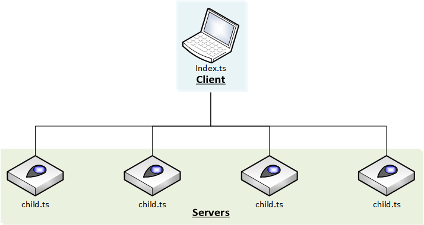

# Learn from Examples
> https://github.com/samchon/tgrid.examples

In this lesson, we'll learn about **TGrid** in depth with simple examples. Also, let's take a look at the code of *Remote Function Call* and demonstrate how the *Remote Function Call* come true the word: *computers to be a computer*. 

  - Demonstration of **TGrid**, who makes <u>computers to be a computer</u>
    - [1. Remote Function Call](#1-remote-function-call)
    - [2. Remote Object Call](#2-remote-object-call)
    - [3. Object Oriented Network](#3-object-oriented-network)
    - [4. Remote Critical Section](#4-remote-critical-section)

## 1. Remote Function Call
Let's see what *Remote Function Call* and how to use it with the below example code. What we're going to implement in this chapter is a remote calculator. The server *provides* a simple arithmetic calculator and client uses it ti perform calculations through the *Remote Function Call*.

  - Server: Provides arithmetic operations
  - Client: Use it

### 1.1. Features
`ISimpleCalculator` is an interface that defines the functions provided to client from the server. Some of you may have noticed already. Ues, `ISimpleCalculator` is the [Controller](concepts.md#23-controller). Then, what is the role of `SimpleCalculator`? Right, it's the [Provider](concepts.md#22-provider) class provided from server to client.

  - [`../controllers/ICalculator.ts`](https://github.com/samchon/tgrid.examples/blob/master/src/controllers/ICalculator.ts#L8-L14)
  - [`../providers/Calculator.ts`](https://github.com/samchon/tgrid.examples/blob/master/src/providers/Calculator.ts#L6-L28)


```typescript::Controller
export interface ISimpleCalculator
{
    plus(x: number, y: number): number;
    minus(x: number, y: number): number;
    multiplies(x: number, y: number): number;
    divides(x: number, y: number): number;
}
```
```typescript::Provider
import { ISimpleCalculator } from "../controllers/ICalculator";

export class SimpleCalculator implements ISimpleCalculator
{
    public plus(x: number, y: number): number
    {
        return x + y;
    }
    public minus(x: number, y: number): number
    {
        return x - y;
    }
    
    public multiplies(x: number, y: number): number
    {
        return x * y;
    }
    public divides(x: number, y: number): number
    {
        if (y === 0)
            throw new Error("Divided by zero.");
        return x / y;
    }
}
```


### 1.2. Server
As I mentioned, the role of server in this example is to *providing* arithmetic calculator for the client. Therefore, server program code is very simple. Just opens a server and provides arithmetic calculator `SimpleCalculator` (be [Provider](concepts.md#22-provider)) to clients who access to server.

#### [`simple-calculator/server.ts`](https://github.com/samchon/tgrid.examples/blob/master/src/projects/simple-calculator/server.ts)
```typescript
<!-- @import("https://raw.githubusercontent.com/samchon/tgrid.examples/master/src/projects/simple-calculator/server.ts") -->
```

### 1.3. Client
Finally, the time to make the long-awaited client program has come. If you compare two example codes, you may find a fact: Two codes are similar. You can see that (a program code connecting to server and using remote calculator provided from server as a client) and (another program code using its own calculator as a single program), both of them have similar program code.

In technical terms, it's considered as "Bsuiness Logic code is perfectly similar". Of course, two program codes are not 100% matched, because of domain logics like client should connect to server or an extra symbol `await` is required for the *Remote Function Call*. However, the Business Logic portion of the two codes is completely homogeneous in fundamental level. Therefore, it helps us to separating Business Logic from Network System perfectly. do you agree?

The ability to call a networked remote system freely of its functions, just like it was my memory object from the beginning. This is the *Remote Function Call*.



On the 17 th line, you can see that after the client has finished connecting to the server, it constructs a [Driver](concepts.md#24-driver)<[Controller](concepts.md#23-controller)> object, by calling the `connector.getDriver<ISimpleCalculator>()` method from [Communicator](concepts.md#21-communicator), for preparing the *remote function calls*.

As you can see, all of the remote function calls to remote system's [Provider](concepts.md#22-provider) are always done through this [Driver](concepts.md#24-driver)<[Controller](concepts.md#23-controller)> object. It would be repeated in all tutorial lessons. Thus, please be aware of it, the [Driver](concepts.md#24-driver)<[Controller](concepts.md#23-controller)>.



#### [`simple-calculator/client.ts`](https://github.com/samchon/tgrid.examples/blob/master/src/projects/simple-calculator/client.ts)

```typescript::Remote-Function-Call
<!-- @import("https://raw.githubusercontent.com/samchon/tgrid.examples/master/src/projects/simple-calculator/client.ts") -->
```
```typescript::Single-Program
<!-- @import("https://raw.githubusercontent.com/samchon/tgrid.examples/master/src/projects/simple-calculator/single.ts") -->
```


> ```python
> 1 + 3 = 4
> 7 - 4 = 3
> 8 x 9 = 72
> 4 / 0 -> Error: Divided by zero.
> ```


## 2. Remote Object Call
In the previous chapter, we've learned how to call functions of remote system. However, the previous chapter handled only singular structured object which defined all functions in its root scope. Therefore, we've never handled the composite structure.

What if the remote object you want to use is a composite structure? What if the final remote function you want to call is placed into deep depth hierarchy with stack of objects? In this case, **TGrid**'s answer is simple and clear.



Just use it~!



### 2.1. Features
In this chapter, we'll demonstrate the *Remote Object Call* using `CompositeCalculator`. The `CompositeCalculator` class extends the [SimpleCalculator](#11-features) to keep supporting four arithmetic operations continuosly. Also, supports `scientific` and `statistics` calculators with internal objects. Therefore, `CompositeCalculator` is a typical of composite structured class.

I think you may already know that, the `CompositeCalculator` would be Provider in the server. Also, `ICompositeCalculator` would be a [Controller](concepts.md#23-controller) in the client.

  - [`../controllers/ICalculator.ts`](https://github.com/samchon/tgrid.examples/blob/master/src/controllers/ICalculator.ts)
  - [`../providers/Calculator.ts`](https://github.com/samchon/tgrid.examples/blob/master/src/providers/Calculator.ts)


```typescript::Controller
<!-- @import("https://raw.githubusercontent.com/samchon/tgrid.examples/master/src/controllers/ICalculator.ts") -->
```
```typescript::Provider
<!-- @import("https://raw.githubusercontent.com/samchon/tgrid.examples/master/src/providers/Calculator.ts") -->
```


### 2.2. Server
Need any explanation about this server code? Only difference between [1. Remote Function Call](#11-server) is [Provider](#concepts.md#22-provider) has been changed from `SimpleCalculator` to `CompositeCalculator`. Oh, and ports number also has been changed.

#### [`composite-calculator/server.ts`](https://github.com/samchon/tgrid.examples/blob/master/src/projects/composite-calculator/server.ts)

```typescript::Remote-Object-Call
<!-- @import("https://raw.githubusercontent.com/samchon/tgrid.examples/master/src/projects/composite-calculator/server.ts") -->
```
```typescript::Remote-Function-Call
<!-- @import("https://raw.githubusercontent.com/samchon/tgrid.examples/master/src/projects/simple-calculator/server.ts") -->
```


### 2.3. Client
In the client program, [Controller](concepts.md#23-controller) has been changed from `ISimpleCalculator` to `ICompositeCalculator`. Also, scopes of target functions have been changed from root scope to composite scope. But as you can see, no problem on the *remote function calls*.

I named remote function calls to composite scoped objects as *"Remote Object Call"* and distinguished it from [Remote Function Call](#13-client). However, they're same in the fundamental level. Despite Provider and Controller have been changed from singular object to composite object, Business Logic codes between network system and single program are still the same.

#### [`composite-calculator/client.ts`](https://github.com/samchon/tgrid.examples/blob/master/src/projects/composite-calculator/client.ts)

```typescript::Remote-Object-Call
<!-- @import("https://raw.githubusercontent.com/samchon/tgrid.examples/master/src/projects/composite-calculator/client.ts") -->
```
```typescript::Single-Program
<!-- @import("https://raw.githubusercontent.com/samchon/tgrid.examples/master/src/projects/composite-calculator/single.ts") -->
```


> ```python
> 1 + 6 = 7
> 7 * 2 = 14
> 3 ^ 4 = 81
> log (2, 32) = 5
> SQRT (-4) -> Error: Negative value on sqaure.
> Mean (1, 2, 3, 4) = 2.5
> Stdev. (1, 2, 3, 4) = 1.118033988749895
> ```


## 3. Object Oriented Network
In this chapter, we'll re-make the *Composite Calculaotr* created in the previous chapter [2. Remote Object Call](#2-remote-object-call) again but with a little bit different; *Hierarchical Calculator*. Previous `CompositeCalculator` has a *scientific* and *statistics* calculators as internal member objects. In the new *HierarchicalCalculator*, we would create in this chapter, those *scientific* and *statistics* calculators would be separated into independent servers.

It means that we need split one calculator server into three different servers. At first, we'll create two new servers responsible for `scientific` and `statistics` calculations. At last, we'll make a mainframe server responsible for 4 arithmetic operations itself and shifting responsibilities to related servers about *scientific* and *statistics* operations; `calculator`.

After we've built all of the servers, we should make the client program using the *Hierarchical Calculator*. Would the Business Logic be kept despite of critical change on the network system's structure? Let's demonstrate it.

 | 
:-------------------:|:-----------------------:
Composite Calculator | Hierarchical Calculator

### 3.1. Features
In this section, [Controller](concepts.md#23-controller)s used by mainframe server are `IScientific` and `ISatistics`. Also, [Controller](concepts.md#23-controller) used by the client program is `ICompositeCalculator`. Wait a minute! [Controller](concepts.md#23-controller) of the client program is exactly same with the previous chapter [2. Remote Object Call](#2-remote-object-call). Have you noticed or felt something? 

Congratulations if you've understood how to implement the *Hierarchical Calculator*, just by looking at the [Controller](concepts.md#23-controller)s. You've already understood everything about the **TGrid**.

  - [`../controllers/ICalculator.ts`](https://github.com/samchon/tgrid.examples/blob/master/src/controllers/ICalculator.ts)
  - [`hierarchical-calculator/calculator.ts#L7-L13`](https://github.com/samchon/tgrid.examples/blob/master/src/projects/hierarchical-calculator/calculator.ts#L7-L13)


```typescript::Controller
<!-- @import("https://raw.githubusercontent.com/samchon/tgrid.examples/master/src/controllers/ICalculator.ts") -->
```
```typescript::Provider
import { Driver } from "tgrid/components";

import { SimpleCalculator } from "../../providers/Calculator";
import { IScientific, IStatistics } from "../../controllers/ICalculator";

export class HierarchicalCalculator 
    extends SimpleCalculator
{
    // REMOTE CALCULATORS
    public scientific: Driver<IScientific>;
    public statistics: Driver<IStatistics>;
}
```


### 3.2. Servers
#### [`hierarchical-calculator/scientific.ts`](https://github.com/samchon/tgrid.examples/blob/master/src/projects/hierarchical-calculator/scientific.ts)
Let's create *scientific* calculator server. It seems very easy, isn't it?

```typescript
<!-- @import("https://raw.githubusercontent.com/samchon/tgrid.examples/master/src/projects/hierarchical-calculator/scientific.ts") -->
```

#### [`hierarchical-calculator/statistics.ts`](https://github.com/samchon/tgrid.examples/blob/master/src/projects/hierarchical-calculator/statistics.ts)
Implementing *statistics* calculator server is also very easy, too.

```typescript
<!-- @import("https://raw.githubusercontent.com/samchon/tgrid.examples/master/src/projects/hierarchical-calculator/statistics.ts") -->
```

####  [`hierarchical-calculator/calculator.ts`](https://github.com/samchon/tgrid.examples/blob/master/src/projects/hierarchical-calculator/calculator.ts)
Now, it's time to create the mainframe server.

Mainframe server computes four arithmetic operations by itself. The *scientific* and *statistics* operations are shifted to related servers and the mainframe server only intermediates computation results. It means that mainframe server has implementation code about the four arthmetic operations and *scientific* and *statistics* operations are done by [Driver](concepts.md#24-driver)<[Controller](concepts.md#23-controller)> objects interacting with related servers.

As a result, the `HierarchicalCalculator` is same with previous chapter's [CompositeCalculator](#21-features) in logically. Although detailed implementation codes of two classes are something different, they have same interface and also provide same features. Now, can't you imagine the client's implementation code, even if you haven't seen the example code?


```typescript::Object-Oriented-Network
<!-- @import("https://raw.githubusercontent.com/samchon/tgrid.examples/master/src/projects/hierarchical-calculator/calculator.ts") -->
```
```typescript::Remote-Object-Call
<!-- @import("https://raw.githubusercontent.com/samchon/tgrid.examples/master/src/projects/composite-calculator/server.ts") -->
```


### 3.3. Client
The Provider class HierarchicalCaluclator is same with previous chapter's [CompositeCalculator](#21-features) in logically. Also, they have same interface although their detailed implementation codes are slightly different.

It means that the client program of this chapter can re-use the `ICompositeCalculator`, which had been used in the previous chapter [2. Remote Object Call](#23-client). [Controller](concepts.md#23-controller) is same with previous chapter and Business Logic is also same. Therefore, these two client programs would have similar implementation code. Le'ts looko at the below codes and find what is different.



The 11th to 12th lines are slightly different. The server address to connect is different.



This is the **TGrid**. It's not a matter whether the system you want to imlement is a program that runs on a single computer or a distributed processing system using network communications. Even within the same network system category, it's no problem how its distributed architecture is constructed. Just remember this one.

With **TGrid**, your Business Logic codes are always similar in any situation.

#### [`hierarchical-calculator/index.ts`](https://github.com/samchon/tgrid.examples/blob/master/src/projects/hierarchical-calculator/index.ts)

```typescript::Object-Oriented-Network
<!-- @import("https://raw.githubusercontent.com/samchon/tgrid.examples/master/src/projects/hierarchical-calculator/index.ts") -->
```
```typescript::Remote-Object-Call
<!-- @import("https://raw.githubusercontent.com/samchon/tgrid.examples/master/src/projects/composite-calculator/client.ts") -->
```
```typescript::Single-Program
<!-- @import("https://raw.githubusercontent.com/samchon/tgrid.examples/master/src/projects/composite-calculator/single.ts") -->
```


> ```python
> 1 + 6 = 7
> 7 * 2 = 14
> 3 ^ 4 = 81
> log (2, 32) = 5
> SQRT (-4) -> Error: Negative value on sqaure.
> Mean (1, 2, 3, 4) = 2.5
> Stdev. (1, 2, 3, 4) = 1.118033988749895
> ```


## 4. Remote Critical Section
With **TGrid**, multiple computers using entwork communication can be turned into A <u>single program</u> running on <u>a virtual computer</u>. The example codes I've shown you throughout this lesson are also intended to demonstrate such concept.

However, the the <u>single virtual program</u> doens't mean the single-threaded program. Rather, it is more like a multi-threading (or multi-processing) program in logically. In other words, all of the systems made by **TGrid** are a type of virtual multi-threading programs.

So, what do you imagine when you hear the word *multi-thread*? Perhaps most of you thought about the *critical sections* like mutex or semaphore. Yes, the most important thing for multi-threading program is to controll these *critical sections* carefully.

Although you succeeded to turn multiple computers using network communications into a single virtual computer through TGrid, it doesn't mean anything if cannot controll those *critical sections*. Thus, in this chapter, we will learn how to control these *critical sections* in network system. However, do not worry, it's never difficult. Controlling network level's *critical sections* are also done by the *Remote Function Call*.



### TSTL
TypeScript Standard Template Library
  - https://tstl.dev

I strongly recommend a library named [TSTL](https://tstl.dev), which supports controlling *critical sections* through `<thread>` module. The classes implemented in the `<thread>` module can be used not only in the single program level, but also in the network level.

`Mutex` used in this chapter is also imported from the [TSTL](https://tstl.dev).

```typescript
import {
    ConditionVariable,
    Mutex, TimedMutex,
    SharedMutex, SharedTimedMutex,
    UniqueLock, SharedLock,
    Latch, Barrier, FlexBarrier,
    Semaphore
} from "tstl/thread";
```



### 4.1. Features
Controller and Provider to be used for controlling remote section are as follows. The client program provides the `CriticalSection` object as a [Provider](concepts.md#22-provider). Also, the server program utilizes the remote [Provider](concepts.md#22-provider) through [Driver](concepts.md#24-driver)<[Controller](concepts.md#23-controller)> with `ICriticalSection`.

As you can see, the features are very simple. `IMutex` would be used to control critical section in the server program. Also, server program would utilize the `ICriticalSection.print()` method. Let's take a look what the method is for.


```typescript::Controller
export interface ICriticalSection
{
    mutex: IMutex;

    print(character: string): void;
}

interface IMutex
{
    lock(): void;
    unlock(): void;
}
```
```typescript::Provider
import { Mutex } from "tstl/thread/Mutex";

export class CriticalSection
{
    public mutex: Mutex = new Mutex();

    public print(character: string): void
    {
        process.stdout.write(str);
    }
}
```


### 4.2. Client


The client program creates 4 *Worker* instances and the 4 *Worker* instances construct 4 `WorkerServers` objects. Also, provides `CriticalSection` classes to each server as a [Provider](concepts.md#22-provider). After the construction, client program waits until 4 `WorkerServer`s to be closed.

As you can see, the actions of the client program is simple. It just provides `CriticalSection` object to each server. The important is how each server controls the *critical section* in network level using the *Remote Function Call*.

#### [`thread/index.ts`](https://github.com/samchon/tgrid.examples/blob/master/src/projects/thread/index.ts)
```typescript
<!-- @import("https://raw.githubusercontent.com/samchon/tgrid.examples/master/src/projects/thread/index.ts") -->
```

### 4.3. Server
Server program controls the *critical section* in network level through the Mutex which is provided from the client program.

As you can see, the server programs picks a random character up (line #38). After that, monopolizes critical section for 1 to 2 seconds and prints the picked up character repeatedly,  (line #19 to #33).

If the *Remote Function Call* can control the *critical sections* even in the network level, the console will repeat the same characters on each line. Otherwise the **TGrid** and [TSTL](https://tstl.dev) failed to control the *critical sections* in network level, the console will print dirty characters.

Now, let's see what happend to the console. The TGrid even can implement the *remote critical section*?

#### [`thread/child.ts`](https://github.com/samchon/tgrid.examples/blob/master/src/projects/thread/child.ts)
```typescript
<!-- @import("https://raw.githubusercontent.com/samchon/tgrid.examples/master/src/projects/thread/child.ts") -->
```

> ```python
> 11111111111111111111
> 88888888888888888888
> 44444444444444444444
> 33333333333333333333
> ```