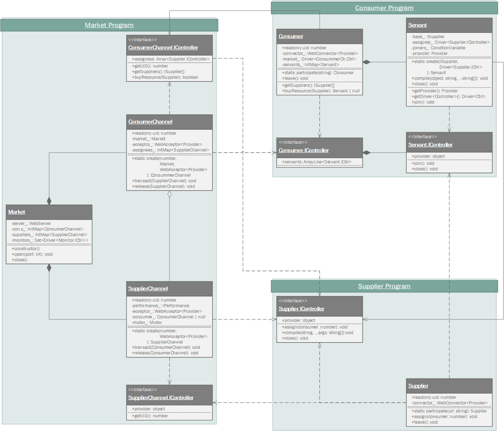

<!-- @templates([
    ["Communicator", "[Communicator](../concepts.md#21-communicator)"],
    ["Provider", "[Provider](../concepts.md#22-provider)"],
    ["Driver", "[Driver](../concepts.md#23-driver)"],
    ["Controller", "[Controller](../concepts.md#24-controller)"],
    ["Market", "[Market](#211-market)"],
    ["Consumer", "[Consumer](#212-consumer)"],
    ["Supplier", "[Supplier](#213-supplier)"],
    ["Monitor", "[Monitor](#214-monitor)"]
]) -->

# Grid Market
## 1. Outline
  - Demo site: http://samchon.org/market
  - Code repository: https://github.com/samchon/tgrid.projects.market


In this section, we will implement a *Grid Market*, a trading market for computing resources.

We'll create an online *Makret*, where you can buy and sell the computing resources, which would be helpful to build Grid Computing systems cheaply. Also, we will build *Consumer* and *Supplier* systems. At last, we would build a *Monitor* system who can observe all transactions occured in the *Market*.

Of course, this project is a type of demo project designed to help you learning about the **TGrid**, so it doesn't really cost you to trading the computing powers. However, the notion of cross trading of computing resources is not a fiction. All the transactions through the *Market*, consumptions and supplies of computing resources between *Consumers* and *Suppliers*, is not a fiction but the real story.

  - ${{ Market }}: An intermediary market where you can trade computing resources
  - ${{ Consumer }}: Purchases and uses computing powers from *Suppliers*
  - ${{ Supplier }}: Provides its computing power to a *Consumer*
  - ${{ Monitor }}: Observes all transactions in the *Market*.


## 2. Design
### 2.1. Participants
#### 2.1.1. Market
*Market* is a main server who represents a brokerage market where you can trade computing power.

*Market* is a web-socket server accepting *Consumers*, *Suppliers* and *Monitors* as clients. Market intermediates, between *Consumers* and *Suppliers*, not only computing power transactions, but also network communications.

Also, the list of all *Consumers* and *Suppliers* participating in the *Market* and transaction details are reported to the *Monitors* in real time.

#### 2.1.2. Consumer
A *Consumer* who purchases and uses *Suppliers*' computing resources.

  - http://samchon.org/market/consumer.html

*Consumer* buys and consumes *Suppliers*' computing resources to build a Grid Computing system. If a *Consumer* succeeded to buying *Suppliers*' computing resources, the *Consumer* delivers source codes to each *Supplier*. Each *Supplier* compiles the delivered source and mounts the compiled program on to a new Worker program. 

The *Consumer* interacts with those Worker programs.

#### 2.1.3. Supplier
*Supplier* provides its computing resources to a *Consumer*.

  - http://samchon.org/market/supplier.html

*Supplier* provides its computing resources to a *Consumer* and receives money in return. Of course, this project is a demo project for learning about the **TGrid**, so it doesn't really return money. In addition, participating in the Market as a Supplier is very simple. Just opens a web browser and connects to a specific URL, that's all.

Also, when the deal with *Consumer* is determined, the *Supplier* would get source code from the *Consumer*. *Supplier* compiles the delivered source code and mount the program on a new Worker. The Worker program would interact with the *Consumer*.

#### 2.1.4. Monitor
*Monitor* observes all the transaction occured in the *Market*.

  - http://samchon.org/market/monitor.html

*Monitor* gets list of all the participants; *Consumers* and *Suppliers*. Also, the *Monitor* observes all of the transactions between *Consumers* and *Suppliers* from the *Market*.

### 2.2. Controllers
#### 2.2.1. Market
There's a ${{ Controller }} defining provided features from *Market* to *Consumers*.

Consumer utilizes this ${{ Controller }} for two main things. The first is to knowing which *Suppliers* are participating in the *Market*; `getSuppliers()`. The second is to buying those *Suppliers*' resources (`buyResource()`) and using them (`assignees`).

```typescript
export namespace ConsumerChannel
{
    export interface IController
    {
        /**
         * `Controller`s of each `Provider` from each *Consumer*.
         */
        assignees: ArrayLike<Supplier.IController>;

        /**
         * Get unique identifier of the *Consumer*.
         */
        getUID(): number;

        /**
         * Entire information list of *Suppliers* in the *Market*.
         */
        getSuppliers(): ISupplier[];

        /**
         * Buy computing resource from a *Suppiler*.
         * 
         * @param uid Unique identifier of the target *Supplier*.
         * @return Whether Succeded to acquire or not.
         */
        buyResource(uid: number): boolean;
    }
}
```

Another ${{ Controller }} defining provided features from *Market* to *Suppliers*.

There're only two features that provided from *Market* to *Supplier*. The first is to getting unique identifier assigned to the *Supplier*. The other one is a variable named `provder`, be a ${{ Provider }} from *Supplier* based on the *Consumer*, also be a ${{ Driver }}<${{ Controller }}> based on the *Supplier*.

  - Consumer: `WebConnector<Provider>.getProvider()`
  - Supplier: `WebConnector.getDriver<Controller>()`

```typescript
export namespace SupplierChannel
{
    export interface IController
    {
        /**
         * A provider from Consumer
         */
        provider: object | null;

        /**
         * Get unique identifier of the *Supplier*.
         */
        getUID(): number;
    }
}
```

#### 2.2.2. Consumer
The ${{ Provider }} from *Market* to *Consumer* just passes through the Consumer as an intermediary. It can be essentially regarded as provided to the *Supplier*. Actullay, *Supplier* connects to *Market* server and utilizes provided remote functions from Consumer's ${{ Provider }} thorugh the `provder: object` variable who is defined in the `Servant.IController`.

```typescript
export namespace Consumer
{
    export interface IController
    {
        /**
         * List of providers for connected suppliers with the consumer.
         */
        servants: ArrayLike<Servant.IController>;
    }
}

export namespace Servant
{
    export interface IController
    {
        /**
         * A provider from consumer.
         */
        provider: object;

        /**
         * Join connection with the consumer.
         */
        join(): void;

        /**
         * Close connection with the consumer.
         */
        close(): void;
    }
}
```

#### 2.2.3. Supplier
The ${{ Provider }} from *Supplier* to *Market*, just passes through Market as an intermediary. It can be essentially regarded as provided to the *Consumer*. Actually, *Consumer* connects to *Market* server and utilizes provided remote functions from the Suplier's ${{ Provider }} through the `assignees: ArrayLike<Supplier.IController>` variable which is defined in the `ConsumerChannel.IController`.

So you can see that all of the features defined in the ${{ Controller }}, an interface defining provided featrues from *Supplier* to *Market* (actually *Consumer*), are concentrating on the *Consumer*. Looking at the functions defined in the ${{ Controller }}, at first, there's a function `assign()` that informing which *Consumer* would receive computing resources from the *Supplier*. At next, a `compile()` function, compiling source code delivered from the *Consumer* and mounting it to a new Worker program, exists.

At last, you can see the `provider` object. This object represents a ${{ Provider }} from Worker program, compiled by source code delivered from the *Consumer*, to Consumer. Within framework of the Consumer or main program of the Supplier, it would be a type of ${{ Driver }}<${{ Controller }}>.

  - `WorkerServer<Provider>.getProvider()`
  - `WorkerConnector.getDriver<Controller>()`

```typescript
export namespace Supplier
{
    export interface IController
    {
        /**
         * A Provider from the Worker program.
         * 
         * Supplier compiles a source code delivered from the Consumer and mounts it to a new
         * Worker program. The object `provider` represents a Provider from the Worker program.
         * Within framework of the Consumer or main program of the Supplier, it would be a type
         * of Driver<Controller>.
         * 
         *   - {@link WorkerServer.getProvider}
         *   - {@link WorkerConnector.getDriver}
         * 
         * @warning Must be {@link compile compiled} before.
         */
        provider: object;

        /**
         * Assign a consumer to receive computing resources of this Supplier.
         */
        assign(consumer_uid: number): void;

        /**
         * Compiles source code and mount a new Worker program.
         * 
         * @param script Source code from the Consumer
         * @param args Arguments of the main function
         */
        compile(script: string, ...args: string[]): void;

        /**
         * Close the mounted Worker program.
         */
        close(): void;
    }
}
```

#### 2.2.4. Monitor
There's a ${{ Provider }} from *Monitor* to *Market*. This Provider is designed only for one purpose and it can be represented by only one word: "Market, let me know everything happening to you". Therefore, All of the functions defined in the Provider and its Controller are designed only to informing what's happening in the *Market* to the *Monitor*.

Monitor can observe all of the transactions occured in the *Market* between *Consumers* and *Suppliers*. In means that whenever a *Consumer* buys a *Supplier*'s computing resources, the *Market* informs the transaction to *Monitors*; `transact()`. Also, whenever a *Consumer* completes its computations and releases the *Suppliers*' computing resources, *Market* informs it to *Monitors*, too; `release()`.

In addiction, *Monitor* can observe the full list of *Consumers* and *Suppliers* participating in the *Market*. When a *Monitor* connects to the *Market* server, the *Market* delivers entire participants list to the *Monitor* by calling the `assign()`. After that, whenever a participant enters or exits, the Market will inform it by calling relevant method like `insertConsumer()` or `eraseSupplier()`, etc.

```typescript
export namespace Monitor
{
    export interface IController
    {
        /**
         * Assign all of the participants in the Market.
         * 
         * @param consumers List of Consumers' nodes
         * @param suppliers List of Suppliers' nodes
         */
        assign(consumers: IConsumerNode[], suppliers: ISupplierNode[]): void;

        /**
         * A Consumer has bought a Supplier's computing resources
         * 
         * @param consumer Unique identifier of the Consumer
         * @param supplier Unique identifier of the Supplier
         */
        transact(consumer: number, supplier: number): void;

        /**
         * A Consumer hasreleased computing resources of Suppliers had bought.
         * 
         * @param consumer Unique identifier of the Consumer
         */
        release(consumer: number): void;

        //----
        // INDIVIDUAL I/O
        //----
        /**
         * A Consumer has newly entered.
         * 
         * @param consumer Information about the Customer.
         */
        insertConsumer(consumer :IConsumerNode): void;

        /**
         * A Supplier has newly entered.
         *
         * @param supplier Information about the Supplier.
         */
        insertSupplier(supplier: ISupplierNode): void;

        /**
         * A Consumer has left.
         * 
         * @param uid Unique identifier of the Consumer
         */
        eraseConsumer(uid: number): void;

        /**
         * A Supplier has left.
         * 
         * @param uid Unique identifier of the Supplier
         */
        eraseSupplier(uid: number): void;
    }
}
```

### 2.3. Class Diagram



## 3. Core Implementation
### 3.1. Market
*Market* is an intermediary market where *Consumers* and *Suppliers* can trade their computing resources.

Therefore, implementation code of the `Market` class starts with opening a websocket server. And whenever a client connects to the *Market* server, the `Market` class identifies its role baased on connection `path` and supports the client by creating a responsible class.

 Path     | Role     | Generated Class
----------|----------|------------------
/consumer | Consumer | ConsummerChannel
/supplier | Supplier | SupplierChannel
/monitor  | Monitor  | Driver<Monitor.IController>

#### [`core/market/Market.ts`](https://github.com/samchon/tgrid.projects.market/blob/master/src/core/market/Market.ts)
```typescript
<!-- @import("https://raw.githubusercontent.com/samchon/tgrid.projects.market/master/src/core/market/Market.ts") -->
```

`ConsumerChannel` is a class designed to corresponding a *Consumer* who connects to the *Market* server as a client.

*Market* server program records and manages list of computing resources of *Suppliers* purchased by the *Consumer* through the `ConsuerChannel` class. Also, through the `ConsumerChannel.Provider` class, the *Consumer* can list up information of *Suppliers*, those who are connecting in the Market, and purchase their computing resources.

#### [`core/market/ConsumerChannel.ts`](https://github.com/samchon/tgrid.projects.market/blob/master/src/core/market/ConsumerChannel.ts)
```typescript
<!-- @import("https://raw.githubusercontent.com/samchon/tgrid.projects.market/master/src/core/market/ConsumerChannel.ts") -->
```

`SupplierChannel` is a class designed to corresponding a *Supplier* who connects to the *Market* server as a client.

*Market* server program records and manages performance information about the *Supplier* through the `SupplierChannel` class. Also, *Consumer* who purchased the *Supplier*'s computing resource is also wrote on the `SupplierChannel` class.

Also, by the `SupplierChannel.Provider` class, the *Consumer* can remotely call functions, provided from the *Supplier* (of Worker program), through the ${{ Driver }}<${{ Controller }}>.

#### [`core/market/SupplierChannel.ts`](https://github.com/samchon/tgrid.projects.market/blob/master/src/core/market/SupplierChannel.ts)
```typescript
<!-- @import("https://raw.githubusercontent.com/samchon/tgrid.projects.market/master/src/core/market/SupplierChannel.ts") -->
```

### 3.2. Consumer
`Consumer` is a Facade class designed for the *Consumer*.

*Consumer* can participate in the *Market* by calling the `Consumer.participate()` method. After that, the *Consumer* can list up all of the *Suppliers* participating in the *Market* by calling the `Consumer.getSuppliers()` method and also can purchase some of their computing resources by calling the `Consumer.buyResource()` method.

#### [`core/consumer/Consumer.ts`](https://github.com/samchon/tgrid.projects.market/blob/master/src/core/consumer/Consumer.ts)
```typescript
<!-- @import("https://raw.githubusercontent.com/samchon/tgrid.projects.market/master/src/core/consumer/Consumer.ts") -->
```

The `Servant` class manages the computing resources purchased from *Suppliers* through the `Consumer.buyResource()`. The key role of the `Servant` class is to being a ${{ Communicator }} interacting with the Worker program mounted on the *Supplier*, even if *Market* and main program of the *Supplier* are located between the *Consumer* and Worker program of the *Supplier*.

Consumer 는 `Servant.compile()` 메서드를 통해 Supplier 에게 제공할 ${{ Provider }} 와, 그것이 실행해야 할 프로그램 소스코드를 건네줄 수 있습니다. 대상 Supplier 는 해당 프로그램 소스코드를 컴파일하고, 이를 새 Worker 프로그램에 탑재하여 구동하게 됩니다. 그리고 그 Worker 프로그램이 바로, 현 Consumer 프로그램과 연동하게 될 최종 인스턴스입니다.

#### [`core/consumer/Servant.ts`](https://github.com/samchon/tgrid.projects.market/blob/master/src/core/consumer/Servant.ts)
```typescript
<!-- @import("https://raw.githubusercontent.com/samchon/tgrid.projects.market/master/src/core/consumer/Servant.ts") -->
```

### 3.3. Supplier
`Supplier` 클래스는 Supplier 를 위해 만들어진 Facade Controller 입니다.

Supplier 는 `Supplier.participate()` 메서드를 호출하여 Market 서버에 접속함으로써, 시장에 참여할 수 있습니다. 그리고 Supplier 클래스의 내부 네임스페이스에 정의된 `Supplier.Provider` 를 이용하여, Market 과 Consumer 가 필요로 하는 기능들을 제공하고 있습니다.

#### [`core/supplier/Supplier.ts`](https://github.com/samchon/tgrid.projects.market/blob/master/src/core/supplier/Supplier.ts)
```typescript
<!-- @import("https://raw.githubusercontent.com/samchon/tgrid.projects.market/master/src/core/supplier/Supplier.ts") -->
```

또한, Supplier 의 식별자 및 performance 에 대한 정보는, 아래 `ISupplier` 구조체로 요약될 수 있습니다. Consumer 는 이 `ISupplier` 에 기재된 Supplier 의 요약정보를 보고, 해당 Supplier 의 자원 구매 여부를 결정하게 됩니다.

#### [`core/supplier/ISupplier.ts`](https://github.com/samchon/tgrid.projects.market/blob/master/src/core/supplier/ISupplier.ts)
```typescript
<!-- @import("https://raw.githubusercontent.com/samchon/tgrid.projects.market/master/src/core/supplier/ISupplier.ts") -->
```

### 3.4. Monitor
`Monitor` 클래스는 Monitor 를 위해 만들어진 Facade Controller 입니다.

Monitor 는 `Monitor.participate()` 메서드를 호출하여 Market 서버에 접속합니다. 그리고 `Monitor` 클래스의 내부 네임스페이스에 정의된 `Monitor.Provider` 클래스와 `Monitor` 클래스의 다양한 accessor 메서드들을 이용하여, 시장에서 발생하는 모든 거래내역을 실시간으로 들여다볼 수 있습니다.

반대로 얘기하면, Market 은 시장에서 참여자 리스트에 변동이 생기거나 새로운 거래내역이 발생할 때마다, ${{ Driver }}<Monitor.IController> 의 함수들을 원격 호출하여 이를 Monitor 에게 알려줍니다.

#### [`core/monitor/Monitor.ts](https://github.com/samchon/tgrid.projects.market/blob/master/src/core/monitor/Monitor.ts)
```typescript
<!-- @import("https://raw.githubusercontent.com/samchon/tgrid.projects.market/master/src/core/monitor/Monitor.ts") -->
```

`ConsumerNode` 클래스는 Market 에 참여한 Consumer 를 표현하기 위해 제작된 클래스로써, 해당 Consumer 구매한 Supplier 의 자원 내역을 기록하고 있습니다.

#### [`core/monitor/ConsumerNode.ts`](https://github.com/samchon/tgrid.projects.market/blob/master/src/core/monitor/ConsumerNode.ts)
```typescript
<!-- @import("https://raw.githubusercontent.com/samchon/tgrid.projects.market/master/src/core/monitor/ConsumerNode.ts") -->
```

`SupplierNode` 클래스는 Market 에 참여한 Supplier 를 표현하기 위해 설계된 클래스로써, 해당 Supplier 의 자원을 구매하여 사용하고 있는 Consumer 에 대한 정보 또한 기록하고 있습니다.

#### [`core/monitor/SupplierNode.ts`](https://github.com/samchon/tgrid.projects.market/blob/master/src/core/monitor/SupplierNode.ts)
```typescript
<!-- @import("https://raw.githubusercontent.com/samchon/tgrid.projects.market/master/src/core/monitor/SupplierNode.ts") -->
```