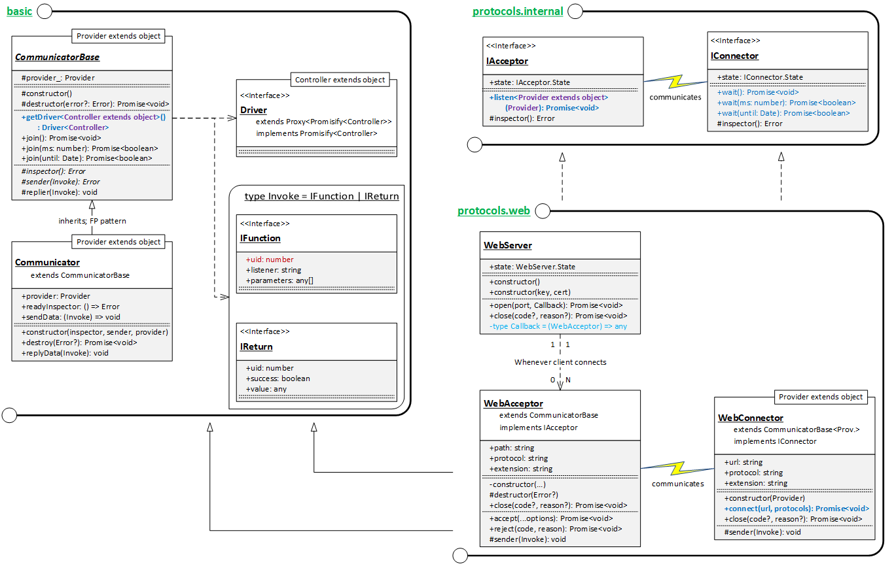

## 1. Outline
**TGrid** supports Web Socket Protocol.

Web Socket Protocol is the only one which is supported in the standard Web Browser, as a real-time network communication protocol. How can **TGrid** not support such unique protocol?


## 2. Components


Supports    | Web Browser | NodeJS
------------|:-----------:|:-------:
[WebServer](#21-webserver) | X | O
[WebAcceptor](#22-webacceptor) | X | O
[WebConnector](#23-webconnector) | O | O

### 2.1. [`WebServer`](https://tgrid.dev/api/classes/tgrid_protocols_web.webserver.html)
Web Socket Server
  - available only in *NodeJS*

The `WebServer` is a class who can open an websocket server. Clients connecting to the `WebServer` would communicate with this server through [WebAcceptor](#22-webacceptor) objects using RFC (Remote Function Call).

To open websocket server, call the [WebServer.open()](https://tgrid.dev/api/classes/tgrid_protocols_web.webserver.html#open) method with a callback function which would be called whenever a client has been connected.

### 2.2. [`WebAcceptor`](https://tgrid.dev/api/classes/tgrid_protocols_web.webacceptor.html)
Web Socket Acceptor
  - available only in *NodeJS*

The `WebAcceptor` is a communicator class interacting with the remote (web socket) client using RFC (Remote Function Call). The `WebAcceptor` objects are always created by the [WebServer](#21-webserver) class whenever a remote client connects to its server.

To accept connection and start interaction with the remote client, call the [WebAcceptor.accept()](https://tgrid.dev/api/classes/tgrid_protocols_web.webacceptor.html#accept) method with special [Provider](Basic-Concepts#12-provider). Also, don't forget to closing the connection after your busines has been completed.

### 2.3. [`WebConnector`](https://tgrid.dev/api/classes/tgrid_protocols_web.webconnector.html)
Web Socket Connector.

The `WebConnector` is a communicator class who can connect to websocket server and interact with it using RFC (Remote Function Call).

You can connect to the websocket server using [WebConnector.connect()](https://tgrid.dev/api/classes/tgrid_protocols_web.webconnector.html#connect) method. The interaction would be started if the server is opened by [WebServer.open()](https://tgrid.dev/api/classes/tgrid_protocols_web.webserver.html#open) and the server accepts your connection by [WebAcceptor.accept()](https://tgrid.dev/api/classes/tgrid_protocols_web.webacceptor.html#accept).

Note that, after you business has been completed, please close the connection using [WebConnector.close()](https://tgrid.dev/api/classes/tgrid_protocols_web.webacceptor.html#close) or let the server to close itself. If you don't close the connection in time, it may waste vulnerable resources of the server.


## 3. Examples 
### 3.1. Composite Calculator
The composite-calculator had handled in the [Basic Concepts - Remote Object Call](Basic-Concepts#3-remote-object-call) subject. Repeating the example, let's review how to use Websocket with [RFC](Basic-Concepts#2-remote-function-call) & [ROC](Basic-Concepts#3-remote-object-call).

#### [`../controllers/ICalculator.ts`](https://github.com/samchon/tgrid.examples/blob/master/src/controllers/ICalculator.ts)
As you've seen in the [Basic Concepts](Basic-Concepts), `ICompositeCalculator` would be [Controller](Basic-Concepts#13-controller) who defines provided features from the server and the features have composite structure.

Look at the below definition. Every functions, provided from server to client, are not placed in the root scope (`ICompositeCalculator`). Some functions are placed in child scoped objects like `ICompositeCalculator.scientific` and `ICompositeCalculator.statistics`.

```typescript
export interface ICompositeCalculator 
    extends ISimpleCalculator
{
    scientific: IScientific;
    statistics: IStatistics;
}

export interface ISimpleCalculator
{
    plus(x: number, y: number): number;
    minus(x: number, y: number): number;
    multiplies(x: number, y: number): number;
    divides(x: number, y: number): number;
}
export interface IScientific
{
    pow(x: number, y: number): number;
    sqrt(x: number): number;
    log(x: number, y: number): number;
}
export interface IStatistics
{
    mean(...elems: number[]): number;
    stdev(...elems: number[]): number;
}
```

#### [`composite-calculator/server.ts`](https://github.com/samchon/tgrid.examples/blob/master/src/projects/composite-calculator/server.ts)
Server provides `Calculator` to clients.

```typescript
import { WebServer, WebAcceptor } from "tgrid/protocols/web";
import { CompositeCalculator } from "../../providers/Calculator";

async function main(): Promise<void>
{
    let server: WebServer = new WebServer();
    await server.open(10102, async (acceptor: WebAcceptor) =>
    {
        await acceptor.accept(new CompositeCalculator());
    });
}
main();
```

#### [`composite-calculator/client.ts`](https://github.com/samchon/tgrid.examples/blob/master/src/projects/composite-calculator/client.ts)
Client connects to [websocket server](#composite-calculatorserverts) and call remote functions. The provided features are defined in the [ICompositeCalculator](#controllersicalculatorts) and client calls those features through `Driver<Controller>`.

As you can see, it's not a matter for RFC (Remote Function Call) whether the provided features are complicated or not.

```typescript
import { WebConnector } from "tgrid/protocols/web";
import { Driver } from "tgrid/components";

import { ICompositeCalculator } from "../../controllers/ICalculator";

async function main(): Promise<void>
{
    //----
    // PREPARES
    //----
    // DO CONNECT
    let connector: WebConnector = new WebConnector();
    await connector.connect("ws://127.0.0.1:10102");

    // GET DRIVER
    let calc: Driver<ICompositeCalculator> = connector.getDriver<ICompositeCalculator>();
    
    //----
    // CALL FUNCTIONS
    //----
    // FUNCTIONS IN THE ROOT SCOPE
    console.log("1 + 6 =", await calc.plus(1, 6));
    console.log("7 * 2 =", await calc.multiplies(7, 2));

    // FUNCTIONS IN AN OBJECT (SCIENTIFIC)
    console.log("3 ^ 4 =", await calc.scientific.pow(3, 4));
    console.log("log (2, 32) =", await calc.scientific.log(2, 32));

    try
    {
        // TO CATCH EXCEPTION IS STILL POSSIBLE
        await calc.scientific.sqrt(-4);
    }
    catch (err)
    {
        console.log("SQRT (-4) -> Error:", err.message);
    }

    // FUNCTIONS IN AN OBJECT (STATISTICS)
    console.log("Mean (1, 2, 3, 4) =", await calc.statistics.mean(1, 2, 3, 4));
    console.log("Stdev. (1, 2, 3, 4) =", await calc.statistics.stdev(1, 2, 3, 4));

    //----
    // TERMINATE
    //----
    await connector.close();
}
main();
```

### 3.2. Console Chat
Bi-directional network application; `console` version.

We've only handled uni-directional network applications that server only provide features and client only utilize them through RFC (Remote Function Call).

From now on, let's make an application that server and client are providing features to each other. Chat application always be the best practice for such bi-directional network application. As **TGrid** is not a type of front-end library, the example would be run on `console`.

#### [`../controllers`](https://github.com/samchon/tgrid.examples/tree/master/src/controllers) & [`../providers`](https://github.com/samchon/tgrid.examples/tree/master/src/providers)
Two [Providers](Basic-Concepts#12-provider) and [Controllers](Basic-Concepts#13-controller).

The chat application is a type of bi-directional network application. Thus, the chat application demans two types of providers and controllers. **Server** requires `Controller` of the client's `Provider`. The **Client** also needs `Controller` of server's `Provider`, too.

Type           | Server         | Client
---------------|----------------|---------------
**Provider**   | [ChatService](https://github.com/samchon/tgrid.examples/blob/master/src/providers/ChatService.ts)    | [ChatPrinter](https://github.com/samchon/tgrid.examples/blob/master/src/projects/console-chat/client.ts#L8-L14)
**Controller** | [`IChatPrinter`](https://github.com/samchon/tgrid.examples/blob/master/src/controllers/IChatPrinter.ts) | [`IChatService`](https://github.com/samchon/tgrid.examples/blob/master/src/controllers/IChatService.ts)

```typescript
//----
// IChatPrinter.ts
//    - client provides to server
//    - server calls through RFC
//----
export interface IChatPrinter
{
    /**
     * Print message to client's console.
     */
    print(name: string, content: string): void;
}

//----
// IChatService.ts
//    - server provides to clients
//    - clients call through RFC
//----
export interface IChatService
{
    /**
     * Set my name.
     * 
     * If duplicated name exists in the remote server, return false.
     * 
     * @return Whether the name is unique in the server or not.
     */
    setName(val: string): boolean;

    /**
     * Talk to everyone who are participating in the server.
     */
    talk(str: string): void;
}
```

#### [`../providers/ChatService.ts`](https://github.com/samchon/tgrid.examples/blob/master/src/providers/ChatService.ts)
  - `ChatService` would be `Provider`.
    - `ChatService` manages *participants*.
    - When disconnected, the participant would be *erased*.
    - When clients *talk*,
  - Server would inform the messages to clients through `Driver<IChatPrinter>`.

```typescript
import { IChatService } from "../controllers/IChatService";

import { Driver } from "tgrid/components";
import { HashMap } from "tstl/container/HashMap";
import { IChatPrinter } from "../controllers/IChatPrinter";

export class ChatService implements IChatService
{
    private static participants_: HashMap<string, Driver<IChatPrinter>> = new HashMap();
    private driver_: Driver<IChatPrinter> = null;
    private name_: string = null;

    public assign(driver: Driver<IChatPrinter>): void
    {
        this.driver_ = driver;
    }

    public destroy(): void
    {
        if (this.name_ !== null)
            ChatService.participants_.erase(this.name_);
    }

    public setName(str: string): boolean
    {
        if (ChatService.participants_.has(str))
            return false; // DUPLICATED NAME
        
        // SET NAME AND ENROLL IT TO DICTIONARY
        this.name_ = str;
        ChatService.participants_.emplace(str, this.driver_);

        // INFORMS TRUE TO CLIENT
        return true;
    }

    public talk(content: string): void
    {
        // INFORM TO EVERYBODY
        for (let it of ChatService.participants_)
        {
            let driver: Driver<IChatPrinter> = it.second;
            if (driver === this.driver_)
                continue; // SKIP HIMSELF

            // INFORM IT TO CLIENT
            let promise: Promise<void> = driver.talk(this.name_, content)

            // DISCONNECTION WHILE TALKING MAY POSSIBLE
            promise.catch(() => {}); 
        }
        console.log(this.name_ + ": " + content);
    }
}
```

#### [`console-chat/server.ts`](https://github.com/samchon/tgrid.examples/blob/master/src/projects/console-chat/server.ts)
  - Server provides `ChatService`.
    - `ChatService` manages *participants*.
    - When disconnection with client, *erase* the participant.
    - When clients *talk*,
  - Server informs chat messages to clients through `Driver<IChatPrinter>`.

```typescript
import { WebServer, WebAcceptor } from "tgrid/protocols/web";
import { Driver } from "tgrid/components";

import { ChatService } from "../../providers/ChatService";
import { IChatPrinter } from "../../controllers/IChatPrinter";

async function main(): Promise<void>
{
    let server: WebServer<ChatService> = new WebServer();
    await server.open(10103, async (acceptor: WebAcceptor<ChatService>) =>
    {
        // PREPARE DRIVER
        let driver: Driver<IChatPrinter> = acceptor.getDriver<IChatPrinter>();
        let service: ChatService = new ChatService();
        service.assign(driver);

        // HANDSHAKE
        await acceptor.accept(service);
        
        // DESTRUCTOR
        await acceptor.join();
        service.destroy();
    });
}
main();
```

#### [`console-chat/client.ts`](https://github.com/samchon/tgrid.examples/blob/master/src/projects/console-chat/client.ts)
  - Client participates in chatting service through `Driver<IChatService>`.
    - When connected, *inform* server its *name*.
    - Repeat *talking* until break.
  - Client provides `ChatPrinter` to server.

```typescript
import { WebConnector } from "tgrid/protocols/web";
import { Driver } from "tgrid/components";

import { Scanner } from "../../utils/Scanner";
import { IChatService } from "../../controllers/IChatService";
import { IChatPrinter } from "../../controllers/IChatPrinter";

class ChatPrinter implements IChatPrinter
{
    public talk(name: string, content: string): void
    {
        console.log(`${name}: ${content}`);
    }
}

async function main(): Promise<void>
{
    //----
    // PREPARATIONS
    //----
    // CONNECT WITH LISTENER
    let connector: WebConnector = new WebConnector(new ChatPrinter());
    await connector.connect("ws://127.0.0.1:10103");

    // SPECIFY CONTROLLER
    let service: Driver<IChatService> = connector.getDriver<IChatService>();

    //----
    // DO CHAT
    //----
    // SET MY NAME
    let nickname: string;
    while (true)
    {
        nickname = await Scanner.read("Insert your nickname: ");
        if (await service.setName(nickname) === true)
            break;
    }

    // TALK UNTIL QUIT
    while (true)
    {
        let content: string = await Scanner.read(nickname + ": ");
        if (content == "")
            break;

        await service.talk(content);
    }

    // QUIT
    await connector.close();
}
main().catch(exp =>
{
    console.log(exp);
});
```

### 3.3. Chat Application
